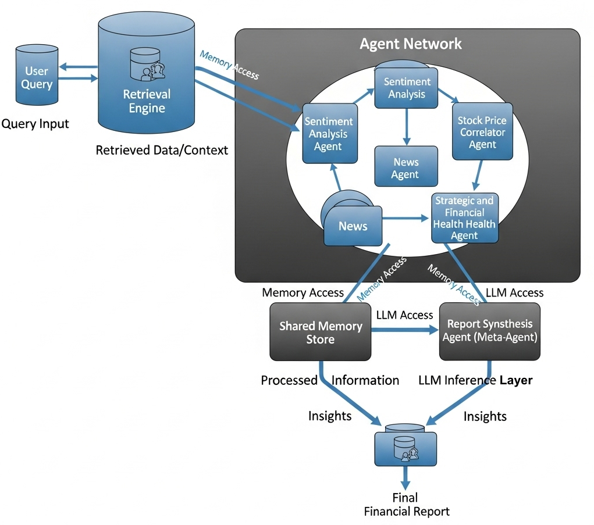

# FIND-MA: A Retrieval-Augmented Multi-Agent Framework for Fundamental Company Analysis and Financial Insight

[](https://github.com/Finance-LLMs/FIND-MA/blob/main/LICENSE)
[](https://www.python.org/downloads/)

**F**inancial **I**nsight via a **N**etwork of **D**istributed **M**ulti-**A**gents

## Abstract

We introduce **FIND-MA**, a Retrieval-Augmented Generation (RAG)-based multi-agent framework for fundamental company analysis aimed at enhancing financial decision-making. FIND-MA leverages the reasoning capabilities of state-of-the-art large language models, including DeepSeek-R1 and Qwen3, which combine structured inference with deep contextual understanding. The framework orchestrates a network of specialized agents, each responsible for evaluating a distinct aspect of a company—such as financial health, market positioning, leadership quality, and strategic risk. These agents collaborate via a shared memory and inter-agent dialogue mechanism, enabling structured, multi-perspective analysis. By aggregating insights across roles, FIND-MA produces explainable, data-driven evaluations to support investors, analysts, and decision-makers.

**Keywords:** retrieval-augmented generation, multi-agent systems, financial NLP, explainability

## 📋 Table of Contents

- [Overview](#-overview)
- [Architecture](#️-architecture)
- [Features](#-features)
- [Agent Roles](#-agent-roles)
- [Dataset](#-dataset)
- [Installation](#-installation)
- [Usage](#-usage)
- [Examples](#-examples)
- [Evaluation](#-evaluation)
- [License](#-license)
- [Citation](#-citation)

## 🎯 Overview

In today's increasingly data-driven financial ecosystem, evaluating a company's intrinsic value requires analyzing a wide array of sources—ranging from financial statements and earnings call transcripts to news coverage and market sentiment. While large language models (LLMs) have recently shown promise in generating summaries and extracting information, their application to financial decision-making remains limited by issues of factual grounding, explainability, and modularity.

FIND-MA addresses these challenges by:

- **Orchestrating specialized agents** for different analytical dimensions
- **Grounding analysis** in curated financial documents spanning 5 years and 30+ companies
- **Providing transparent, traceable insights** through shared memory and inter-agent dialogue
- **Producing structured outputs** such as SWOT analyses, strategic risk profiles, and financial health assessments

## 🏗️ Architecture



FIND-MA consists of five primary components:

### Core Components

1. **Retrieval Engine**: FAISS-based dense vector retriever indexing annual reports, earnings transcripts, and financial news
2. **Agent Network**: Specialized agents for different analytical dimensions (sentiment, stock correlation, news, financial health)
3. **Shared Memory Store**: Persistent memory enabling inter-agent communication and context sharing
4. **LLM Inference Layer**: DeepSeek-R1 and Qwen3 models serving as generative engines
5. **Report Synthesizer**: Compiles agent outputs into structured, human-readable reports

### Design Philosophy

- **Explainability**: Transparent outputs grounded in retrieved context with accessible reasoning steps
- **Modularity**: Extensible architecture supporting new agents without system redesign
- **Factual Grounding**: All generation conditioned on curated retrieval base to reduce hallucination

## ✨ Features

- **Multi-Agent Coordination**: Specialized agents for sentiment analysis, stock price correlation, news analysis, and financial health assessment
- **Retrieval-Augmented Generation**: Grounded in real financial documents and data
- **Explainable AI**: Traceable reasoning with source attribution
- **Comprehensive Analysis**: SWOT analyses, risk assessments, sentiment tracking, and strategic insights
- **Multiple LLM Support**: DeepSeek-R1 and Qwen3 integration with dynamic model routing
- **Structured Output**: JSON and markdown export capabilities
- **Real-time Analysis**: Fast processing with sub-minute report generation

## 🤖 Agent Roles

### Sentiment Analysis Agent
- **Purpose**: Evaluates tone and sentiment in company communications
- **Sources**: Earnings call transcripts, press releases
- **Capabilities**: Speaker-aware analysis, temporal sentiment tracking, bullish/bearish classification
- **Model**: DeepSeek-R1

### Stock Price Correlator Agent
- **Purpose**: Connects textual events to stock price movements
- **Sources**: Earnings calls, filings, news aligned with price data
- **Capabilities**: Event-price correlation, causal hypothesis generation
- **Model**: DeepSeek-R1

### News Agent
- **Purpose**: Analyzes recent events and their potential impact
- **Sources**: Financial news, media coverage, press releases
- **Capabilities**: Relevance scoring, impact assessment, credibility evaluation
- **Model**: Qwen3

### Strategic and Financial Health Agent
- **Purpose**: Evaluates capital structure, revenue trajectory, and strategic goals
- **Sources**: Annual reports, investor presentations
- **Capabilities**: Financial metrics extraction, ratio analysis, business outlook assessment
- **Model**: DeepSeek-R1

### Report Synthesis Agent (Meta-Agent)
- **Purpose**: Compiles outputs into cohesive final reports
- **Sources**: All agent outputs
- **Capabilities**: Cross-agent coherence, conflict flagging, structured report generation
- **Model**: Dynamic (Qwen3/DeepSeek-R1)

## 📊 Dataset

Our curated dataset includes:

- **500+ documents** covering **30+ companies** across diverse sectors
- **5 years** of financial data (2019-2024)
- **Multiple document types**: Annual reports, earnings call transcripts, financial news
- **Rich metadata**: Company, year, sector, source type annotations
- **Manual quality control** with expert validation

### Sectors Covered
- Pharmaceuticals
- Semiconductors  
- Telecommunications
- Technology
- Defense
- Healthcare

## 🚀 Installation

### Prerequisites
- Python 3.8+
- CUDA-compatible GPU (recommended)
- 16GB+ RAM

### Setup

1. **Clone the repository**
```bash
git clone https://github.com/Finance-LLMs/FIND-MA.git
cd FIND-MA
```

2. **Create virtual environment**
```bash
python -m venv findma-env
source findma-env/bin/activate  # On Windows: findma-env\Scripts\activate
```

3. **Install dependencies**
```bash
pip install -r requirements.txt
```

4. **Download models** (if running locally)
```bash
# DeepSeek-R1 and Qwen3 model setup
# Follow instructions in docs/model_setup.md
```

5. **Set up environment variables**
```bash
export HUGGINGFACE_API_KEY="your_key_here"
export OPENAI_API_KEY="your_key_here"  # If using OpenAI models
```

## 💡 Usage

### Basic Usage

```python
from findma import FINDMA

# Initialize the framework
framework = FINDMA()

# Analyze a company
report = framework.analyze_company("Apple Inc.")

# Get structured output
print(report.executive_summary)
print(report.swot_analysis)
print(report.risk_assessment)
```

### Advanced Usage

```python
# Custom agent configuration
config = {
    "agents": ["sentiment", "news", "financial_health"],
    "models": {"primary": "deepseek-r1", "fallback": "qwen3"},
    "retrieval_top_k": 10
}

framework = FINDMA(config=config)
report = framework.analyze_company("Microsoft", config=config)
```

### Command Line Interface

```bash
# Analyze a single company
python -m findma analyze --company "Tesla Inc." --output report.json

# Batch analysis
python -m findma batch --companies companies.txt --output-dir reports/

# Interactive mode
python -m findma interactive
```

## 📈 Examples

### Sample Output Structure

```json
{
  "company": "Apple Inc.",
  "analysis_date": "2024-03-15",
  "executive_summary": "...",
  "swot_analysis": {
    "strengths": ["Strong brand loyalty", "Diversified product portfolio"],
    "weaknesses": ["High dependency on iPhone sales"],
    "opportunities": ["AI integration", "Services growth"],
    "threats": ["Regulatory scrutiny", "Market saturation"]
  },
  "sentiment_analysis": {
    "overall_sentiment": "positive",
    "trend": "improving",
    "key_themes": ["innovation", "growth", "market_expansion"]
  },
  "financial_health": {
    "score": 8.5,
    "key_metrics": {...},
    "concerns": [...]
  },
  "agent_outputs": {...},
  "source_attribution": {...}
}
```

## 📊 Evaluation

Our evaluation across 20 companies shows:

- **Factual Accuracy**: 4.3/5.0 ± 0.4
- **Interpretability**: 4.5/5.0 ± 0.3  
- **Relevance**: 4.2/5.0 ± 0.5
- **Cross-Agent Consistency**: 86% agreement
- **Average Latency**: 42.7 seconds per report

### Comparison with Baselines

FIND-MA outperforms single-prompt baselines in:
- Traceability and explanation clarity
- Inter-reviewer agreement on accuracy
- Reduced hallucination through role-specific prompts

## 📄 License

This project is licensed under the MIT License - see the [LICENSE](LICENSE) file for details.

## 📚 Citation

If you use FIND-MA in your research, please cite:

```bibtex
@article{udandarao2024findma,
  title={FIND-MA: A Retrieval-Augmented Multi-Agent Framework for Fundamental Company Analysis and Financial Insight},
  author={Udandarao, Vikranth and Parmar, Akshat},
  year={2024},
  institution={IIIT Delhi}
}
```